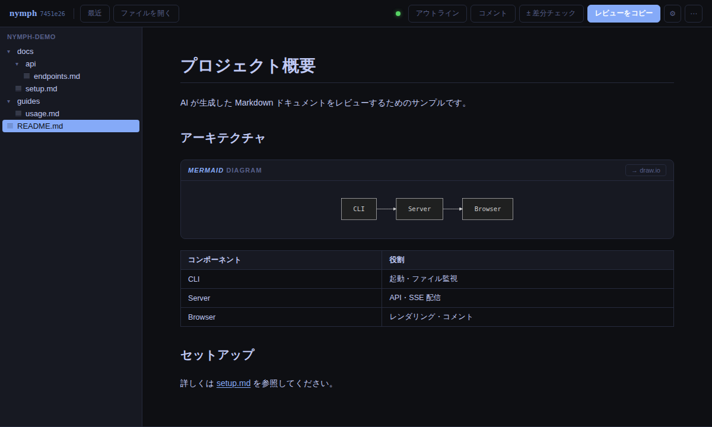
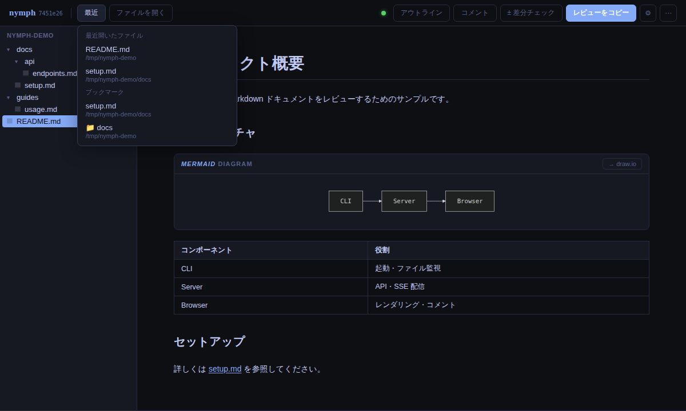
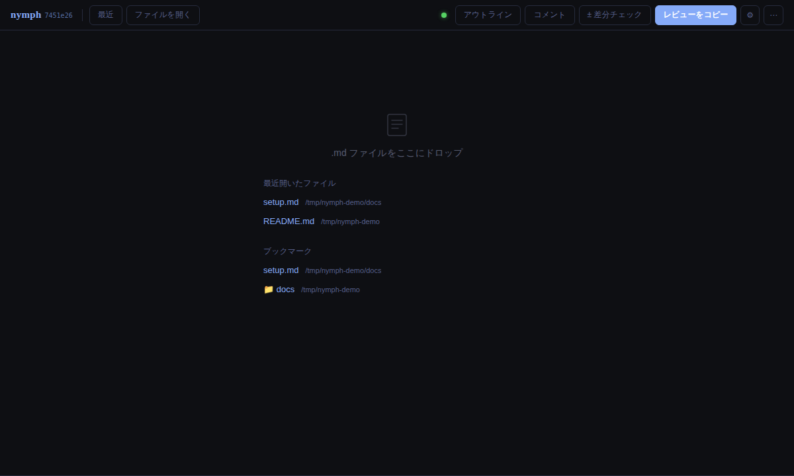
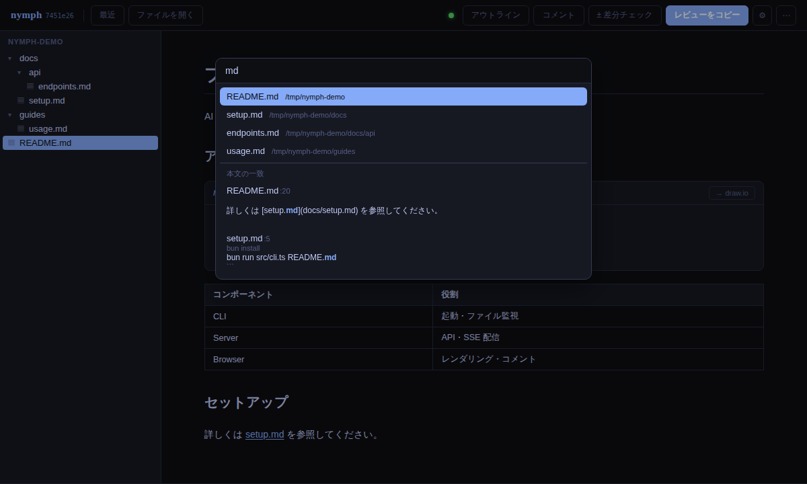

# nymph

AI が生成した Markdown・Mermaid をレビューするための軽量ツール。

```bash
nymph output.md
```

ブラウザが開き、ファイルを監視して自動再レンダリングします。

**スタック**: Bun · React 18 · TypeScript · Vite 7

---

## 要件

- **Bun** (`mise use -g bun` または [bun.sh](https://bun.sh))

---

## インストール

**bunx（インストール不要）**
```bash
bunx @fillu87gyc/nymph *.md
```

**グローバルインストール**
```bash
bun install -g @fillu87gyc/nymph
nymph *.md
```

**単一バイナリ（Bun 不要で配布可）**
```bash
bun build --compile src/cli.ts --outfile nymph
./nymph *.md
```

**ローカル開発**
```bash
git clone https://github.com/fillu87gyc/nymph
cd nymph
bun install
bun run src/cli.ts output.md
```

---

## 使い方

```bash
nymph output.md
# nymph   http://localhost:6276
# 監視中  /path/to/output.md
# Ctrl+C で停止
```

複数ファイルや glob も指定できます：

```bash
nymph *.md
```

ディレクトリを渡すと、VSCode のようにサイドバーへ階層ツリーを表示して `.md` を開けます：

```bash
nymph ./docs
nymph ./           # カレントディレクトリをツリー表示
```

### オプション

```
使い方: nymph [オプション] [ファイル|ディレクトリ ...]

引数:
  ファイル ...          監視する .md ファイル（glob 対応）
  ディレクトリ          サイドバーにツリー表示して .md を開けるようにする

オプション:
  -p, --port <番号>    使用するポート番号 (デフォルト: 6276)
  --host [ホスト]      バインドするホスト (省略時 0.0.0.0 = LAN に公開)。
                       未指定の場合は 127.0.0.1 (自 PC のみ)。
                       ⚠ nymph は認証なしでファイルを公開するため信頼できる
                       ネットワークでのみ使用してください。
  --no-open            ブラウザを自動的に開かない
  -v, --version        バージョンを表示して終了
  -h, --help           このヘルプを表示して終了
```

```bash
nymph -p 8080 output.md        # ポートを指定
nymph --no-open output.md      # ブラウザを開かずに起動
nymph --host output.md         # LAN 内の他端末からも見えるように公開 (opt-in)
nymph --version                # バージョン確認
```

---

## 機能

### ホットリロード

ファイルの変更を SSE で検知し、即座に再レンダリングします。

### ディレクトリツリー（エクスプローラー）

`nymph ./docs` のようにディレクトリを渡すと、サイドバーに階層ツリーが表示されます（`.md` のみ、隠しディレクトリと `node_modules` は除外）。クリックしたファイルはタブに追加されます。ツールバーの **フォルダを開く** からパスを入力して、起動後にツリーのルートを切り替えることもできます。



### 最近開いたファイル

開いたファイルの履歴を `~/.local/share/nymph/recent.json` に保存します（最大 20 件）。ツールバーの **最近** メニューと、引数なし起動時の画面から再オープンできます。



引数なしで起動すると、履歴とブックマークが起動画面に表示されます。



### ブックマーク

ツールバーの **★** で、表示中のファイル（未選択時はツリーのルートディレクトリ）を登録できます。**最近** メニューと起動画面に表示され、ファイルは開く・ディレクトリはツリーのルート切替になります。

### Quick Open（Ctrl+P）

`Ctrl+P` / `Cmd+P` で検索パレットを開き、タブ・履歴・ブックマーク・ツリー内の全ファイルを横断して絞り込み、`Enter` で開けます。



### Mermaid レンダリング + draw.io エクスポート

Mermaid コードブロックをインラインでレンダリングします。各ダイアグラムに **→ draw.io** ボタンがあり、`.drawio` ファイルのダウンロードまたはコードのコピーができます。

### インラインコメント

レンダリングされた各ブロックにホバーすると **＋** ボタンが表示されます。テキスト選択でも範囲コメントが追加できます。コメントはレビュー対象ファイルを汚さないよう `~/.local/share/nymph/reviews/<key>/comments.json`（`<key>` はファイルの絶対パスから決定論的に導出）に自動保存されます。

### レビューのコピー

**レビューをコピー** ボタンで全コメントを JSON 形式でクリップボードにコピーします。

### チェックポイント / Diff

**📍** ボタンでチェックポイントを設定し、**± diff** ボタンで変更箇所をハイライト表示できます。チェックポイントはコメントと同じ `~/.local/share/nymph/reviews/<key>/checkpoint` に保存されます。

---

## ユビキタス言語辞書

プロジェクトルートの `.nymph/config.yml` を使って、`docs/UBIQUITOUS_LANGUAGE.md` から辞書ファイルを生成できます。

```bash
nymph dict build
```

`.nymph/dict.json` に辞書ファイルが出力されます（`.gitignore` 対象のため生成ファイルは追跡しません）。

```bash
# デバッグ出力（ノード木とマッチ結果を .nymph/debug/ に保存）
nymph dict build --debug
```

用語集のソースは `docs/UBIQUITOUS_LANGUAGE.md` です。新しいモジュールや概念を追加したときはこちらも更新してください。

---

## 開発

```bash
bun install
bun run dev        # API サーバー(:6276) + Vite(:5173) を同時起動
bun run test       # 単体 + コンポーネントテスト (Vitest 3)
bun run test:e2e   # E2E テスト (Playwright)
bun run build      # プロダクションビルド (Vite 7)
```

**ghq を使っている場合の開発用ショートカット（`~/.zshrc`）**

```zsh
nymphx() {
  local nymph_dir origdir="$PWD"
  if [[ -f package.json ]] && grep -q '"name": "@fillu87gyc/nymph"' package.json; then
    nymph_dir="$PWD"
  else
    nymph_dir="$(ghq list --full-path nymph | grep '/nymph$' | head -1)"
  fi
  local -a a
  for f in "$@"; do
    case "$f" in
      /*) a+=("$f") ;;
      *)  a+=("$origdir/$f") ;;
    esac
  done
  local port=6276
  while (: < /dev/tcp/127.0.0.1/$port) 2>/dev/null; do ((port++)); done
  (cd "$nymph_dir" && NYMPH_PORT="$port" NYMPH_FILES="${a[*]}" bun run dev)
}
```

```bash
nymphx *.md   # HMR 有効な開発モードで起動
```

---

## Claude Code との連携

Claude Code のプロジェクトに nymph を追加すると、Edit ツールによるファイル編集時にコメントの行番号が自動追従します。

```bash
claude plugin install github:fillu87gyc/nymph
```

Claude Code 上でフックをインストール：

```
/nymph:install
```

仕組み：`PostToolUse` フックが Edit ツールの `old_string` / `new_string` を `/edit-op` エンドポイントに転送し、編集前後の行数差分でコメント位置を自動補正します。

---

## ライセンス

MIT — 詳細は [`LICENSE`](./LICENSE)。

`dist/` に bundle 化して同梱しているサードパーティ・ソフトウェア（highlight.js /
diff / DOMPurify / marked / Mermaid / KaTeX / React / SWR ほか）の帰属表示・
ライセンス全文は [`THIRD_PARTY_NOTICES.md`](./THIRD_PARTY_NOTICES.md) を参照して
ください。
