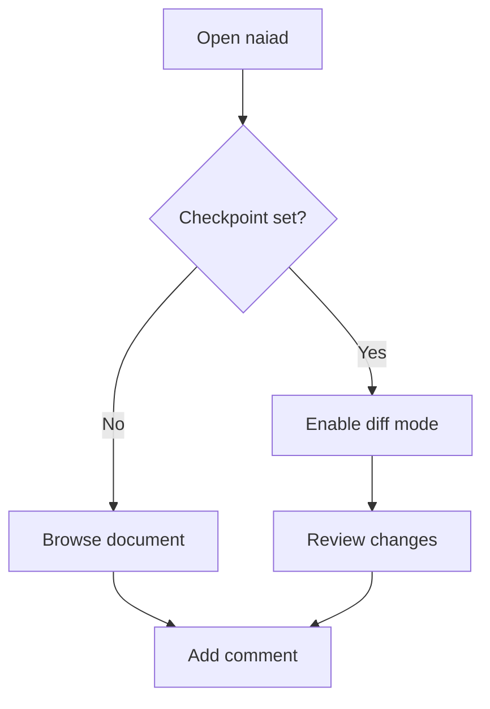

# Full-Spec Document

Introductory paragraph with **bold text**, *italic text*, and `inline code` to demonstrate rich formatting.

## 1. Code Blocks

```typescript
interface User {
  id: number;
  name: string;
  email: string;
}

function createUser(name: string, email: string): User {
  return { id: Date.now(), name, email };
}
```

```python
def fibonacci(n: int) -> list[int]:
    """Return the first n Fibonacci numbers."""
    result = [0, 1]
    while len(result) < n:
        result.append(result[-1] + result[-2])
    return result[:n]

print(fibonacci(10))
```

## 2. Feature Table

| Feature           | Status | Notes                   |
| ----------------- | ------ | ----------------------- |
| Code highlighting | ✅     | Powered by highlight.js |
| Mermaid diagrams  | ✅     | Client-side rendering   |
| Diff view         | ✅     | Checkpoint-based        |
| Comments          | ✅     | Persistent JSON storage |
| File tabs         | ✅     | Multi-file support      |

## 3. Mermaid Diagram



## 4. Blockquote

> **Important:** This is a blockquote with *emphasized* content. It demonstrates
> the `blockquote` rendering capability with multiple visual elements.

## 5. Lists

- Markdown parsing with marked.js
- Syntax highlighting via highlight.js
- Diagram rendering with Mermaid
- Diff computation and visualization

1. Review the checkpoint
2. Enable diff mode
3. Add comments to changed blocks

## 6. Modified Section

This line remains unchanged in the document.
This specific line will be modified to trigger the diff view highlight.

## 7. Conclusion

This final paragraph concludes the full-spec document. All Markdown block types are represented above.
